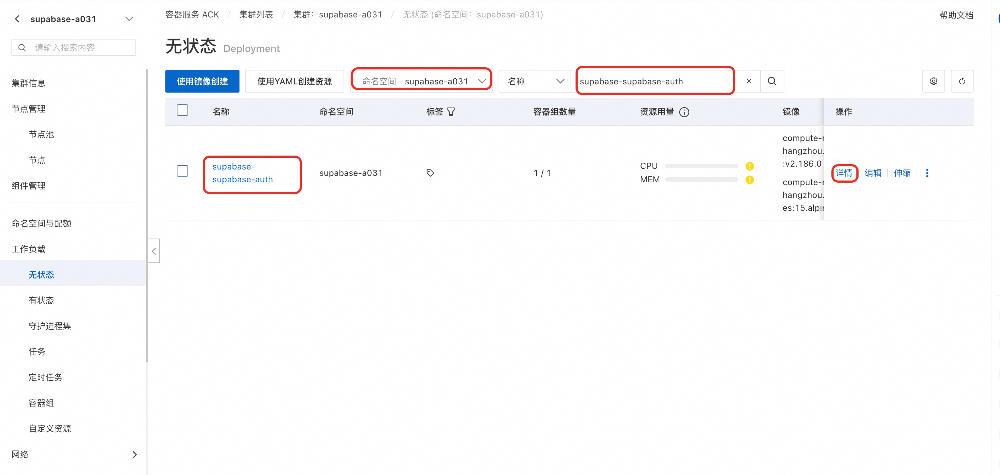
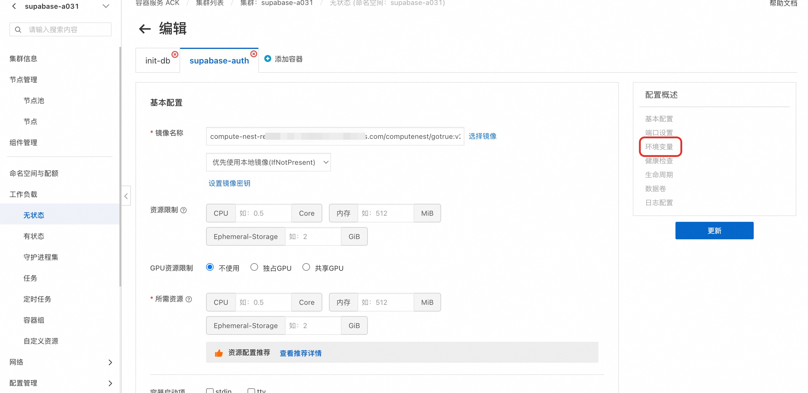

# 开源 Supabase 配置指南

## 一、部署参数

| 参数 | 必填 | 说明 |
| --- | --- | --- |
| `ClusterId` | 是（仅已有集群版） | ACK 集群 ID |
| `DeploymentNamespace` | 否 | 部署命名空间，留空用栈名 |
| `DashboardUsername` | 是 | Studio 控制台用户名 |
| `DashboardPassword` | 是 | Studio 控制台密码 |
| `DbPassword` | 是 | PostgreSQL 密码，仅字母数字 |
| `JwtSecret` | 是 | JWT 密钥，≥32 位 |
| `OAuthProvider` | 否 | `none` / `github` / `google` |
| `OAuthClientId` | 选 OAuth 时必填 | OAuth App Client ID |
| `OAuthClientSecret` | 选 OAuth 时必填 | OAuth App Client Secret |
| `EnableSaml` | 否 | `true` / `false`（默认 false） |
| `SamlIdpMetadataUrl` | 开 SAML 时必填 | IdP Metadata URL |
| `SamlDomain` | 开 SAML 时必填 | 登录邮箱域名 |

### Manager 模板参数（接入开源 Supabase）

`SupabaseDeploymentMode` 选 `UseExistingOpenSource`，填写：

| 参数 | 说明 | 来源 |
| --- | --- | --- |
| `ExistingSupabaseUrl` | 公网地址，如 `http://IP:8000` | Supabase 输出 `SupabaseUrl` |
| `ExistingSupabaseInternalUrl` | 集群内网地址 | Supabase 输出 `InternalUrl` |
| `ExistingSupabaseAnonKey` | Anon Key | Supabase 输出 `AnonKey` |
| `ExistingSupabaseServiceRoleKey` | Service Role Key | Supabase 输出 `ServiceRoleKey` |
| `ExistingSupabaseDatabaseUrl` | 数据库连接串 | Supabase 输出 `DatabaseUrl` |

## 二、集群配置命令

以下命令中 `<ns>` 替换为 Supabase 所在的 namespace。

### 设置 Site URL（部署 Manager 后必做）

```bash
kubectl -n <ns> set env deployment/supabase-supabase-auth \
  GOTRUE_SITE_URL="http://<Manager-IP>:8080" \
  GOTRUE_URI_ALLOW_LIST="http://<Manager-IP>:8080/"
kubectl -n <ns> rollout restart deployment/supabase-supabase-auth
```

### 配置 SMTP（启用邮箱认证）

```bash
kubectl -n <ns> set env deployment/supabase-supabase-auth \
  GOTRUE_SMTP_HOST="smtp.example.com" \
  GOTRUE_SMTP_PORT="465" \
  GOTRUE_SMTP_USER="noreply@example.com" \
  GOTRUE_SMTP_PASS="<密码或授权码>" \
  GOTRUE_SMTP_SENDER_NAME="Agent Manager" \
  GOTRUE_SMTP_ADMIN_EMAIL="noreply@example.com" \
  GOTRUE_MAILER_AUTOCONFIRM="false"
kubectl -n <ns> rollout restart deployment/supabase-supabase-auth
```

### 手动开启 SAML

模板部署时设 `EnableSaml=true` 会自动完成以下步骤。手动维护时：

```bash
# 1. 生成私钥
openssl genrsa 2048 | openssl rsa -traditional -outform DER | base64 | tr -d '\n' > /tmp/saml-key.txt

# 2. 写入 GoTrue
kubectl -n <ns> set env deployment/supabase-supabase-auth \
  GOTRUE_SAML_ENABLED=true \
  GOTRUE_SAML_PRIVATE_KEY="$(cat /tmp/saml-key.txt)" \
  GOTRUE_SAML_EXTERNAL_URL="http://<Supabase-IP>:8000/auth/v1" \
  API_EXTERNAL_URL="http://<Supabase-IP>:8000/auth/v1"
kubectl -n <ns> rollout restart deployment/supabase-supabase-auth

# 3. 注册 SAML Provider
curl -X POST "http://<Supabase-IP>:8000/auth/v1/admin/sso/providers" \
  -H "apikey: <ServiceRoleKey>" \
  -H "Authorization: Bearer <ServiceRoleKey>" \
  -H "Content-Type: application/json" \
  -d '{"type":"saml","metadata_url":"<IdP-Metadata-URL>","domains":["example.com"],"attribute_mapping":{"keys":{"email":{"name":"email"}}}}'
```

IdP 侧填写：
- **Entity ID / Metadata URL**: `http://<Supabase-IP>:8000/auth/v1/sso/saml/metadata`
- **ACS URL**: `http://<Supabase-IP>:8000/auth/v1/sso/saml/acs`

### 查看当前配置

```bash
# GoTrue 环境变量
kubectl -n <ns> get deployment supabase-supabase-auth \
  -o jsonpath='{range .spec.template.spec.containers[0].env[*]}{.name}={.value}{"\n"}{end}' \
  | grep -iE 'SITE_URL|SMTP|SAML|MAILER|EXTERNAL_URL'

# Auth Settings API
curl -s "http://<Supabase-IP>:8000/auth/v1/settings" -H "apikey: <AnonKey>" | python3 -m json.tool
```

## 三、通过 ACK/ACS 控制台修改配置

不习惯 `kubectl` 命令行的用户，可以在阿里云容器服务控制台操作：

1. 登录 [ACK 控制台](https://cs.console.aliyun.com/) 或 [ACS 控制台](https://acs.console.aliyun.com/)，进入对应集群。
2. 左侧导航 **工作负载** → **无状态（Deployments）**，选择 Supabase 所在的命名空间。找到 `supabase-supabase-auth`，点击名称进入详情。

      

3. 点击右上角 **编辑** → **环境变量**，可直接添加或修改以下变量：
   - `GOTRUE_SITE_URL` — Manager 公网地址
   - `GOTRUE_URI_ALLOW_LIST` — Manager 公网地址
   - `GOTRUE_SMTP_HOST` / `GOTRUE_SMTP_PORT` / `GOTRUE_SMTP_USER` / `GOTRUE_SMTP_PASS` — SMTP 配置
   - `GOTRUE_SMTP_SENDER_NAME` / `GOTRUE_SMTP_ADMIN_EMAIL` — 发件人信息
   - `GOTRUE_MAILER_AUTOCONFIRM` — 设为 `false` 开启邮箱验证
   - `GOTRUE_SAML_ENABLED` / `GOTRUE_SAML_PRIVATE_KEY` — SAML 配置
   - `GOTRUE_SAML_EXTERNAL_URL` / `API_EXTERNAL_URL` — 设为 `http://<Supabase-IP>:8000/auth/v1`
   
      

4. 保存后 Deployment 会自动滚动更新，等待新 Pod Running 即可。

## 四、Manager 控制台配置

部署完成后在 Manager 管理后台操作：

### 设置 Site URL

**路径：** `/admin/sso-config` → 回调地址配置

界面保存会返回 501，需通过 `kubectl set env` 或 ACK/ACS 控制台设置 `GOTRUE_SITE_URL`（见上文）。

### 配置 SAML SSO

**路径：** `/admin/sso-config`

1. 页面会显示 SP 信息（Entity ID、ACS URL），复制到 IdP 侧配置应用。
2. 在 IdP 获取 Metadata URL 后，点击「添加 SSO 配置」，填入 IdP Metadata URL 和邮箱域名。
3. 在页面顶部「登录模式」下拉选 `saml`，保存。

### 配置 OAuth

**路径：** `/admin/sso-config`

1. 在第三方平台（GitHub / Google 等）创建 OAuth App，回调地址填 `http://<Supabase-IP>:8000/auth/v1/callback`。
2. 在 Supabase Studio 控制台（`http://<Supabase-IP>:8000`）→ Authentication → Providers，启用对应 Provider 并填入 Client ID / Secret。
3. 回到 Manager `/admin/sso-config`，点击刷新，确认 Provider 状态为已启用。
4. 登录模式选 `oauth`，保存。

### 配置邮箱认证

**路径：** `/admin/email-auth`

界面开关不可用（返回 501），需通过 `kubectl set env` 或 ACK/ACS 控制台配置 SMTP 环境变量（见上文）。配置完成后界面会自动检测到 SMTP 已配置和邮箱认证已开启。
